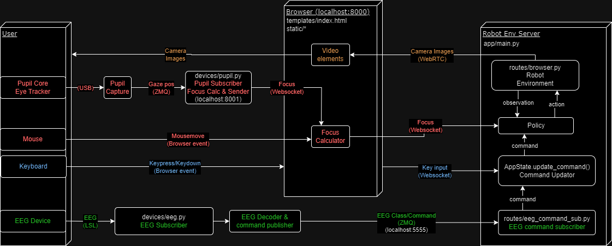

# multiagent-bmi-webui
Web UI for the multi-agent robot arm environment

## Overview



## Installation
1. Create and activate a virtual environment. Tested with Python 3.10.
2. Install [robohive](https://github.com/dosssman/robohive/tree/multi-robot)
    ```bash
    git clone --recursive https://github.com/dosssman/robohive.git
    cd robohive
    git checkout multi-robot
    pip install -e .
    ```
3. Clone this repository.
4. 
    ```bash
    pip install -e .
    ```

## Run
Activate your virtual environment, then:
1. Run environment server:
    ```bash
    python mabui/app/main.py
    ```
    and open http://localhost:8000/ in your browser
2. Pupil Core
    - If you have the device
        1. Connect the device and run Pupil Capture
        2. Run Pupil Core websocket server:
            ```
            python mabui/devices/pupil.py
            ```
    - If you don't have the device, run the mock websocket server:
        ```bash
        python mabui/devices/pupil_mock.py  # mock
        ```
    - Click "Connect to eye tracker" button on the browser.
      The red frame should move according to the position of your gaze.
3. EEG
    - If you have the device
        (not implemented)
    - If you don't have the device, run the mock EEG command ZMQ publisher:
        ```bash
        python mabui/devices/eeg.py  # mock
        ```
      Commands to the robot are determined according to the class into which the brain waves are classified.

The commands are reflected in the action of the robot with the camera enclosed in the red frame.
Currently, commands are integers from 0 to 3 as follows
- 0: stationary
- 1-3: random action
