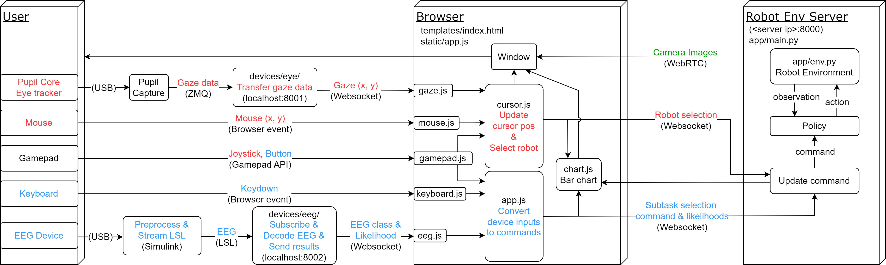

# multiagent-bmi-webui
Web UI for the multi-agent robot arm environment

## Overview



## Installation
1. Create and activate a virtual environment. Tested with Python 3.10.
2. Install [robohive](https://github.com/dosssman/robohive/tree/multi-robot)
    ```bash
    git clone --recursive https://github.com/dosssman/robohive.git
    cd robohive
    git checkout multi-robot
    pip install -e .
    ```
3. Clone this repository
4. Install
    ```bash
    # server only
    pip install -e .[server]
    # user only
    pip install -e .[user]
    # both
    pip install -e .[server,user]
    ```

- On Linux, you need to install `liblsl` to use the [LSL](https://github.com/sccn/liblsl).
    Choose the appropriate version for your OS in the [release page](https://github.com/sccn/liblsl/releases) and then
    ```bash
    wget https://github.com/sccn/liblsl/releases/download/v1.16.2/liblsl-1.16.2-focal_amd64.deb  # change to the appropriate one
    sudo apt install libpugixml1v5  # dependencies
    sudo dpkg -i liblsl-1.16.2-focal_amd64.deb
    ```

- On windows, you need to open ports for the WebRTC UDP communication.
Open Windows Firewall settings (`wf.msc`) and create a new inbound rule to allow UDP ports `49152-65535`.

- You may need to comment out `max_episode_steps` in `robohive/envs/arms/__init__.py` to remove the episode time limit.


## Run
Activate your virtual environment, then:
1. Run environment server:
    ```bash
    python app/main.py
    ```
    and open http://\<server ip\>:8000/ in your browser
2. Pupil Core
    - If you have the device
        1. Connect the device and run Pupil Capture
        2. Run Pupil Core websocket server:
            ```
            python app/devices/pupil.py
            ```
    - If you don't have the device, run the mock websocket server:
        ```bash
        python app/devices/pupil_mock.py  # mock
        ```
    - Click the "Connect to eye tracker" button on the browser.
      The red frame should move according to the position of your gaze.
3. EEG
    - If you have the device, start measuring and LSL streaming.
    - If you don't have the device, run the mock EEG command ZMQ publisher:
        ```bash
        python app/devices/eeg.py  # mock; see the file for options
        ```
      Commands to the robot are determined according to the class into which the brain waves are classified.

The commands are reflected in the action of the robot with the camera enclosed in the red frame.
Currently, commands are integers from 0 to 3 as follows
- 0: stationary
- 1-3: random action
