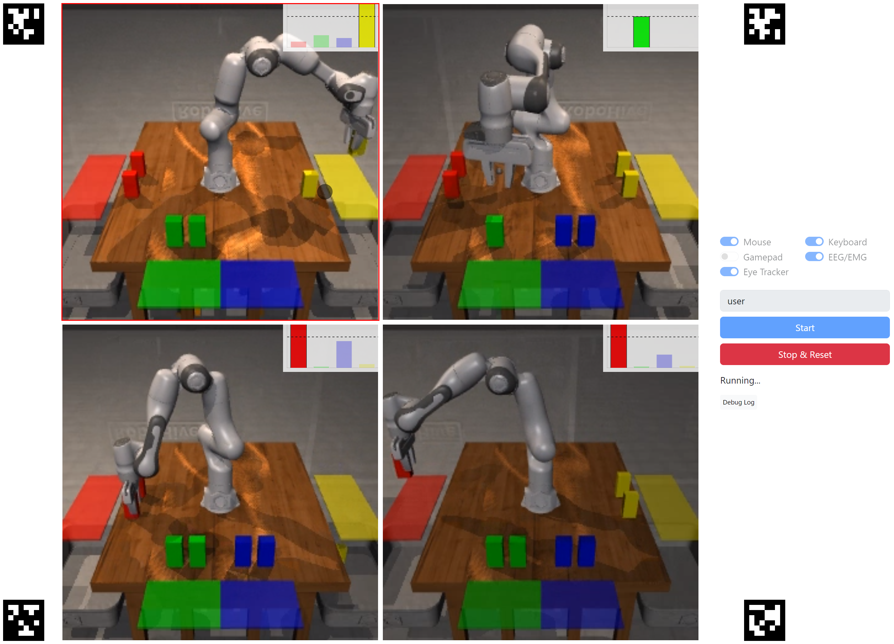

# multiagent-bmi-webui
Web UI for the multi-agent robot arm environment



## Overview


## Installation
1. (Recommended) Create and activate a virtual environment with Python 3.8.
    ```bash
    micromamba create -n multiagent python=3.8 -y
    micromamba activate multiagent
    ```
2. Clone this repository and setup the various sub-modules and dependencies:
    ```bash
    git clone --recurse-submodules -j8 git@github.com:arayabrain/multiagent-bmi-webui.git
    pip install -e multiagent-bmi-webui/robohive-multi/robohive/.
    pip install -e multiagent-bmi-webui/robohive-multi/vtils/.
    pip install -e multiagent-bmi-webui/robohive-multi/.

    # Vtils hotfix
    rm -rf multiagent-bmi-webui/robohive-multi/vtils/__init__.py # Prevents a bug down the GELLO line of work
    touch  multiagent-bmi-webui/robohive-multi/vtils/sockets/__init__.py

    # Access freshly installed repository
    cd multiagent-bmi-webui
    ```
3. Install this repository.
    ```bash
    # Server only
    pip install -e '.[server]'
    # User only
    pip install -e '.[user]'
    # Both
    pip install -e '.[server,user]'
    ```
4. (If you are launching a server) Generate a self-signed certificate for the server. If you are using other machines as clients, please add the accessible IP address of the server to `.keys/san.cnf`.
    ```cnf
    [ alt_names ]
    IP.1 = 127.0.0.1  # localhost
    IP.2 = <your server ip>
    ```
    Then, run the following commands to generate the certificate and keys:
    ```bash
    cd .keys
    openssl req -new -nodes -out server.csr -keyout server.key -config san.cnf
    openssl x509 -req -days 365 -in server.csr -signkey server.key -out server.crt -extensions req_ext -extfile san.cnf
    ```

- On Linux, you need to install [`liblsl`](https://github.com/sccn/liblsl) in order to use LSL. Choose the appropriate version for your OS in the [release page](https://github.com/sccn/liblsl/releases) and then install.
    ```bash
    wget https://github.com/sccn/liblsl/releases/download/v1.16.2/liblsl-1.16.2-focal_amd64.deb  # Change to the appropriate OS
    sudo apt install libpugixml1v5  # Install dependencies
    sudo dpkg -i liblsl-1.16.2-focal_amd64.deb
    ```
- On Windows, you need to open ports for the WebRTC UDP communication. Open Windows Firewall settings (`wf.msc`) and create a new inbound rule to allow UDP ports `49152-65535`.
- Some antivirus software also implement additional firewall rules (ESET, Avast, etc...), so make sure to disable them or add exceptions if the robots are not being rendered into the UI.

5. For machines with lower CPU clock, `gamemode` increases the priority of the main and sub-processes, making the UI smoother, especially for the 16 robots mode.
- Install `gamemode` (Ubuntu). [More info](https://github.com/FeralInteractive/gamemode)
```bash
sudo apt-get install gamemode
```
- For more aggressive CPU governing, edit `/etc/gamemode.ini`, and setting `renice=15` or higher.
- Run with `gamemoderun python app/main.py`

Best performance / UI responsiveness with the 16 robots mode was achieved on an `Intel i9-11900K 8C 16T @ 3.5GHz`.
`gamemode` allowed a similar responsiveness on an `Intel Xeon Silver 4216 CPU 16C 32T @ 2.10Ghz`.

## Run
See [user_guide.md](user_guide.md) for usage instructions.

## Updating robohive-multi and other submodules
In case the underlying `robohive-multi` has been updated, execute the following command to update your local `robohive-multi` submodule:
```bash
git pull --all
git submodule update --remote --merge # for robohive-multi update only. For full depth, add --recursive
```

## Development
See [development.md](development.md) for instructions on development (adding a new device, etc.).
