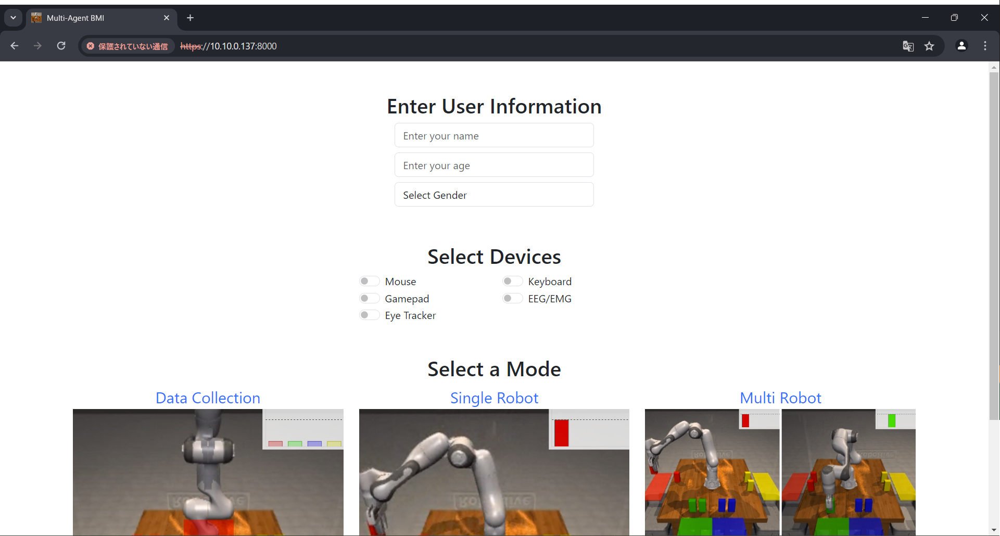

**Setup Robot Environment Server**
1. Open a terminal and SSH connect to the server that runs the robot environment
   - In the following, the IP of the server is referenced by the variable `${SERVER_IP}`
2. Start the environment on the server
    ```bash
    cd path/to/multiagent-bmi-webui
    python app/main.py
    ```

**Connect to WebUI**
1. Access the web interface at `https://\${SERVER_IP}:8000`  
    
2. Enter the user information and check the devices you will use
3. Start up the devices and make sure they are ready for connection
   - See below for the setup instructions
4. Select the mode to use

**Setup Robot Selection Devices**
- Gamepad: Press any button at the environment page so that the browser can detect the gamepad
- Pupil Core
    1. Launch the Pupil Capture app
    2. Adjust the eye cameras
    3. Perform a calibration
    4. For user feedback, reduce the size of the window and keep it on the foreground by `Win + Ctrl + T`
    5. Run the Websocket server that streams the gaze data
        ```bash
        python app/devices/eye/main.py -e ${SERVER_IP}
        ```

**Setup Subtask Selection Devices**
- Gamepad: Press any button at the environment page so that the browser can detect the gamepad
- EEG/EMG: See below

**EEG/EMG: Data Collection Mode**
1. Start the recorder in a terminal
    ```bash
    python app/devices/eeg/main.py -e ${SERVER_IP} --no-decode
    ```
2. Click the "Data Collection" link in the mode selection
    - The recorder connects to the browser
3. When a prompt to start baseline measurement appears in the terminal, press Enter to start the measurement  
    
    - Logs show up every 5 seconds, but ignore them and just press the Enter key
4. In the browser, press the "Start" button and follow the cues to collect data  
    
    - Subjects must give a signal for 2 seconds at the same time "Go" is displayed
5. When the data collection is completed, a popup appears  
    
    - Click "Back to Menu" to return to the index page
6. End the EEG recorder with Ctrl+C in the terminal

**EEG/EMG: Model Training**
- Run train.py
    ```bash
    python app/devices/eeg/train.py --load-latest-recording
    ```
    - The script will load the latest recording data and train the model
    - If you want to train the model with a specific data, remove `--load-latest-recording` and specify the user_id and the exp_id with `-u ${USERNAME} -d ${EXP_ID}`

**EEG/EMG: Task Execution**
1. Start the EEG decoder & recorder in a terminal
    ```bash
    python app/devices/eeg/main.py -e ${SERVER_IP} --load-latest-model
    ```
    - The script will load the latest trained model
2. When a prompt to start baseline measurement appears in the terminal, press Enter to start the measurement  
3. Press the "Start" button and execute the task  
    
4. When the task is completed, a popup appears  
    
    - Click "Back to Menu" to return to the index page
5. End the EEG decoder & recorder with Ctrl+C in the terminal

