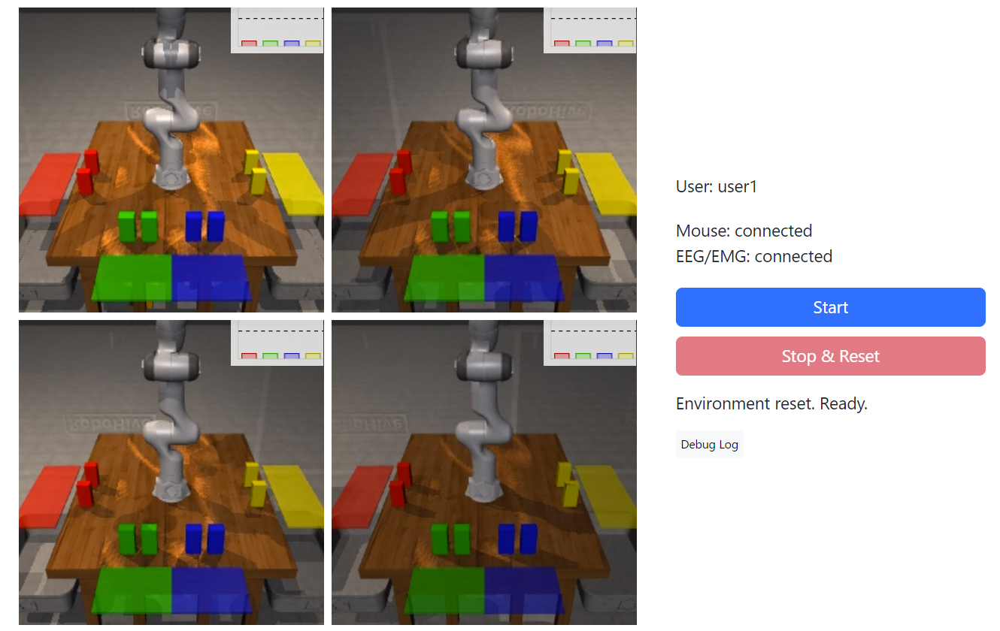

**Robot Environment Server Setup**
1. Open a terminal and SSH connect to the server that runs the robot environment
    ```bash
    ssh vector  # IP address: 10.10.0.137
    ```
2. Start the environment
    ```bash
    cd path/to/multiagent-bmi-webui
    python app/main.py
    ```

**Robot Selection Device Setup**
- Mouse/Gamepad: Just turn on the toggle switch in the browser
- Pupil Core
    1. Launch the Pupil Capture app
    2. Adjust the eye cameras
    3. Perform a calibration
    4. For user feedback, reduce the size of the window and keep it on the foreground by `Win + Ctrl + T`
    5. Run this in another terminal
        ```bash
        python app/devices/eye/main.py -e 10.10.0.137
        ```
    6. Turn on the "Eye Tracker" toggle switch in the browser

**EEG/EMG: Data Collection Mode**
1. Access the web interface for data collection mode via a browser
   - https://10.10.0.137:8000/data-collection
   - Enter username (`<user>`)
   
2. Start the recorder in a terminal
    ```bash
    python app/devices/eeg/main.py -e 10.10.0.137 --no-decode -u <user>
    ```
3. Turn on the "EEG/EMG" toggle switch in the browser
   - The recorder connects to the browser
4. When a prompt to start baseline measurement appears in the terminal, press Enter to begin measurement
    
    - Logs show up every 5 seconds, but ignore them and just press the Enter key
5. In the browser, press the "Start" button and follow the cues to collect data
6. When "Completed!" appears,
   - Press "Stop&Reset" button
   - Turn off the "EEG/EMG" toggle switch
   - End the EEG recorder with Ctrl+C in the terminal

**EEG/EMG: Model Training**
- Run train.py
    ```bash
    python app/devices/eeg/train.py -u <user> -d <YYYYMMDD_HHMMSS>
    ```
    - `-d`: date of the recorder's saved data `app/devices/eeg/logs/user1/YYYYMMDD_HHMMSS/recording.hdf5`

**Task**
1. Access the web interface via a browser
    - https://10.10.0.137:8000
    
2. Enter username
    - Practice: `<user>-practice` (or any other name you like except `<user>`)
    - Task: `<user>`
3. Start the EEG decoder & recorder in a terminal
    ```bash
    python app/devices/eeg/main.py -e 10.10.0.137 -u <user> -d <YYYYMMDD_HHMMSS>
    ```
    - Here the username should be the same as the one used for model training (`<user>`)
    - (Use `--no-record` if you do not wish to record)
4. Turn on the "EEG/EMG" toggle switch in the browser
5. When a prompt to start baseline measurement appears in the terminal, press Enter to begin measurement
6. Press the "Start" button and execute the task
7. When "Completed!" appears, press "Stop&Reset" button
   - To start the task without recalibrating the baseline,
       - Change the username (`<user>`)
       - Go back to 6.
8. Turn off the "EEG/EMG" toggle switch
9. End the EEG decoder & recorder with Ctrl+C in the terminal

